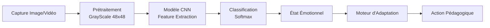
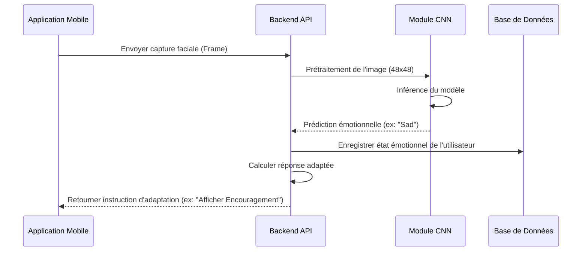

# Chapitre 3 : Conception Architecturale et Détaillée

## 3.1 Introduction
Ce chapitre présente l'organisation structurelle du système et détaille les choix techniques effectués pour répondre aux besoins fonctionnels. Nous mettons l'accent sur l'intégration du module d'intelligence artificielle pour la détection des émotions et l'adaptation du contenu pédagogique en temps réel.

## 3.2 Architecture globale du système

### 3.2.1 Architecture logique (n-tiers)
Le système adopte une architecture en couches (N-Tiers) permettant une séparation claire entre l'interface utilisateur, la logique métier, les services d'intelligence artificielle et la persistance des données.

```mermaid
graph TD
    subgraph "Couche Présentation"
        App[Application Mobile <br/>(React Native / Flutter)]
    end

    subgraph "Couche Logique Métier"
        API[Backend API <br/>(Node.js / Django / Spring)]
    end

    subgraph "Couche IA"
        EmotionMod[Module Détection Émotions <br/>(CNN / Keras)]
        IAGMod[Module IAG <br/>(GPT API / LLM)]
    end

    subgraph "Couche Données"
        DB[(Base de Données <br/>MongoDB / PostgreSQL)]
    end

    App <--> API
    API <--> EmotionMod
    API <--> IAGMod
    API <--> DB
```

### 3.2.2 Architecture technique
L'architecture technique repose sur des protocoles de communication standardisés (REST/GraphQL). Le module de détection des émotions est intégré comme un micro-service ou une fonction spécialisée au sein du backend, capable de traiter les flux d'images ou les captures périodiques envoyées par l'application mobile.

### 3.2.3 Diagramme de déploiement UML
Ce diagramme illustre comment les composants logiciels sont répartis sur l'infrastructure matérielle.

```mermaid
deploymentDiagram
    node "Smartphone Apprenant" {
        component "Application Mobile"
    }

    node "Serveur d'Application (Cloud)" {
        node "Environnement d'Exécution" {
            component "Backend API Service"
            component "Module IA (Emotion Detection)"
        }
    }

    node "Serveur de Base de Données" {
        database "Database (User & Learning Data)"
    }

    node "Fournisseur d'IA Externe" {
        component "LLM Service (OpenAI/Gemini)"
    }

    "Smartphone Apprenant" -- "HTTPS" : "Appel API"
    "Backend API Service" -- "Internal" : "Inférence ML"
    "Backend API Service" -- "TCP/IP" : "Requêtes SQL/NoSQL"
    "Backend API Service" -- "HTTPS" : "Génération Contenu"
```

---

## 3.3 Conception du module de détection des émotions

### 3.3.1 Approche retenue (Analyse Faciale & Comportementale)
En complément de l'analyse visuelle directe, le système peut corréler les expressions détectées avec des indicateurs comportementaux :
*   **Temps de réponse** aux questions.
*   **Nombre d'erreurs consécutives** (Frustration).
*   **Patterns de navigation** (Scrolling rapide, hésitations).
*   **Temps passé par écran**.

### 3.3.2 Modèle émotionnel adopté
Le modèle est entraîné pour classifier 7 émotions fondamentales : **Colère (Angry), Dégoût (Disgust), Peur (Fear), Joie (Happy), Neutre (Neutral), Tristesse (Sad) et Surprise (Surprise)**. 
Ces émotions sont ensuite interprétées pour déclencher des actions d'adaptation :
*   **Neutralité/Joie** : Poursuite du rythme actuel.
*   **Tristesse/Frustration** : Proposition d'une aide ou d'un exercice plus simple.
*   **Surprise/Confusion** : Explications détaillées ou changement de format.

### 3.3.3 Pipeline de traitement


### 3.3.4 Choix algorithmique (CNN)
Le choix s'est porté sur un **Réseau de Neurones Convolutif (CNN)** personnalisé, implémenté avec Keras/TensorFlow.
**Détails de l'architecture :**
*   **4 Blocs Convolutifs** : Utilisant des filtres croissants (128, 256, 512, 512) pour capturer des traits de plus en plus complexes.
*   **MaxPooling2D** : Pour réduire la dimensionnalité spatiale et les calculs.
*   **Dropout (0.4 / 0.3)** : Appliqué à chaque couche pour éviter le surapprentissage (overfitting).
*   **Couches Denses (Fully Connected)** : 512 et 256 neurones avant la couche de sortie.
*   **Sortie Softmax** : 7 neurones représentant la probabilité de chaque classe d'émotion.

### 3.3.5 Diagramme de séquence : processus de détection


