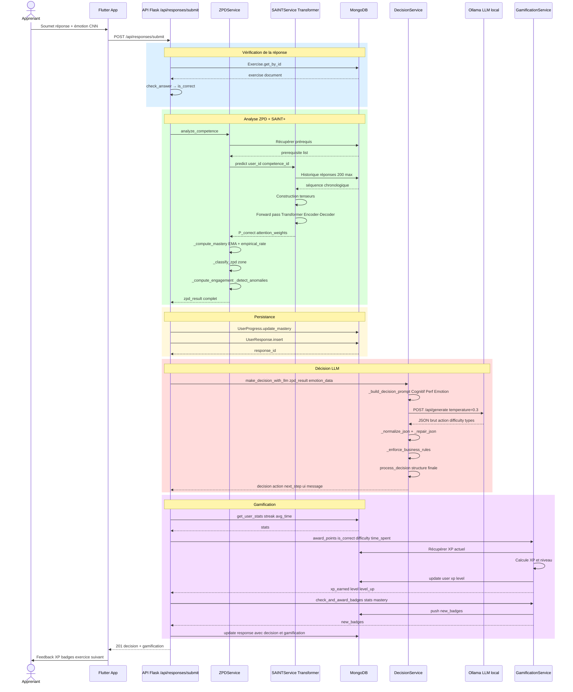

# 📘 Processus d'Adaptation de l'Exercice et de la Difficulté

## 1. Description Descriptive du Processus

Le système d'apprentissage adaptatif repose sur une **boucle de rétroaction continue** qui analyse en temps réel la performance cognitive, le comportement et l'état émotionnel de l'apprenant pour ajuster dynamiquement les exercices proposés.

### 1.1 Les acteurs du système

| Acteur | Rôle |
|--------|------|
| **Frontend (Flutter)** | Capture la réponse + émotions via CNN, envoie au backend |
| **ZPDService** | Classifie la compétence dans une zone (ZPD, Frustration, Maîtrisé) |
| **SAINTService** | Modèle Deep Learning (Transformer) prédit P(correct) et calcule la maîtrise |
| **DecisionService** | Pilote LLM (Ollama) qui décide de l'action pédagogique |
| **GamificationService** | Calcule XP, niveaux et badges selon la performance |
| **ExerciseGenerator** | Génère un exercice adapté selon la difficulté et le type recommandés |

---

### 1.2 Les zones d'apprentissage (Théorie de Vygotski - ZPD)

```
  Maîtrise  [0.0 ──────────── 0.4 ──────────── 0.75 ──────────── 1.0]
                  FRUSTRATION         ZPD              MAÎTRISÉ
                  (trop difficile)  (optimal)      (passer à la suite)
```

- **Zone de Frustration** (mastery < 0.4) : trop difficile → adapter à la baisse ou réviser
- **Zone Proximale de Développement** (0.4 ≤ mastery < 0.75) : Zone idéale d'apprentissage
- **Zone Maîtrisée** (mastery ≥ 0.75) : Compétence acquise → passer à la suivante

---

### 1.3 Comment SAINT+ calcule la maîtrise

Le modèle **SAINT+** (Self-Attentive INTeractive Knowledge Tracing) est un **Transformer Encoder-Decoder** :

1. **Entrée** : Séquence chronologique de toutes les réponses de l'apprenant
2. **Traitement** : Mécanisme d'attention multi-tête qui identifie les interactions passées les plus influentes
3. **Sortie** : P(correct) — probabilité de réussir le prochain exercice

La **maîtrise finale** est calculée par fusion :

```
mastery = 0.65 × EMA(P_correct) + 0.35 × taux_empirique_récent
```

- `EMA` = Moyenne Mobile Exponentielle (α=0.25) sur l'historique → stabilité
- `taux_empirique_récent` = Proportion de succès sur les 5 dernières tentatives → réactivité

---

### 1.4 Comment le LLM (Ollama) prend la décision

Le `DecisionService` construit un **prompt pédagogique structuré** à 3 niveaux de priorité :

| Priorité | Source | Données |
|----------|--------|---------|
| 🥇 **Cognitif** | ZPD + SAINT+ | Maîtrise, Zone ZPD, P(correct) |
| 🥈 **Performance** | Réponse soumise | Correct/Incorrect, Temps, Indices, Engagement, Anomalies |
| 🥉 **Émotionnel** | CNN détection | Émotion dominante, Frustration détectée |

L'LLM retourne un **JSON strict** :

```json
{
  "action": "continue | next | adapt | pause",
  "recommended_difficulty": 0.5,
  "suggested_exercise_types": ["qcm", "code_completion"],
  "message": "Message pédagogique pour l'élève",
  "encouragement": "Message de soutien"
}
```

#### Les 4 actions possibles

| Action | Condition | Effet |
|--------|-----------|-------|
| **`continue`** | Progression normale | Exercice similaire, difficulté ±0.05 |
| **`next`** | Maîtrise ≥ 0.85 ET zone = mastered | Passer à la compétence suivante |
| **`adapt`** | Difficulté inadaptée | Ajustement >0.1, changement de type d'exercice |
| **`pause`** | Frustration élevée + engagement <30% | Recommander une pause |

#### Règles métier non contournables (`_enforce_business_rules`)

- Si mastery ≥ 0.85 ET zone = mastered → **forcer** `action = "next"` (surpasse le LLM)
- Clamp de la difficulté dans [0.1, 1.0]
- Validation des types d'exercices contre la liste autorisée
- Fallback dynamique si le LLM échoue

---

### 1.5 Adaptation de la difficulté par type d'exercice

```
Facile    [0.0 → 0.4]  : qcm, vrai_faux, texte_a_trous, exercice_guide
Moyen     [0.4 → 0.7]  : qcm_multiple, code_completion
Difficile [0.7 → 1.0]  : code_libre, debugging, projet_mini, logic_puzzle
```

---

### 1.6 La Gamification

| Événement | XP |
|-----------|----|
| Réponse correcte | +10 XP (base) |
| Réponse incorrecte | +2 XP (effort) |
| Multiplicateur de difficulté | × (1.0 + difficulty × 0.5) |
| Bonus sans indice | +5 XP |
| Bonus rapidité (<30s) | +10 XP |
| Engagement émotionnel élevé | +5 XP |

Formule de niveau : `Level = floor(√(XP / 50)) + 1`

| Badge | Critère |
|-------|---------|
| 🥾 Premier Pas | 1 exercice complété |
| 📚 Débutant Sérieux | 10 exercices complétés |
| ⭐ Perfectionniste | Série de 5 succès consécutifs |
| 🏆 Maître de la Série | Série de 10 succès consécutifs |
| ⚡ Cerveau Agile | Temps moyen <20s sur 5 exercices |
| 🎓 Maître de Compétence | Maîtrise ≥ 0.9 sur une compétence |

---

## 2. Processus de Fonctionnement — 8 Étapes

**Étape 1 — Extraction des données**
Réception de : user_id, exercise_id, competence_id, answer, time_spent, hints_used, emotion_data, current_mastery_level

**Étape 2 — Vérification de la réponse**
`Exercise.check_answer()` → retourne `is_correct: bool`

**Étape 3 — Analyse ZPD + SAINT+**
`ZPDService.analyze_competence()` appelle `SAINTService.predict()` qui :
- Construit la séquence historique depuis MongoDB (200 réponses max)
- Effectue l'inférence Transformer → P(correct)
- Calcule mastery = EMA + empirical_rate
- Classifie la zone (ZPD / Frustration / Maîtrisé)
- Analyse les prérequis → si non satisfaits, force zone = Frustration
- Calcule engagement, probabilité d'indice, détection d'anomalies

**Étape 4 — Mise à jour de la maîtrise**
`UserProgress.update_mastery()` → persiste en MongoDB

**Étape 5 — Sauvegarde de la réponse**
`UserResponse.create()` + `UserResponse.insert()` → stockage complet

**Étape 6 — Décision pédagogique LLM**
`DecisionService.make_decision_with_llm()` :
- Construit prompt multi-métriques
- Appelle Ollama, parse et valide le JSON
- Applique `_enforce_business_rules()`
- Retourne `process_decision()` : structure finale

**Étape 7 — Gamification**
- `award_points()` → XP + niveau
- `check_and_award_badges()` → badges
- Si level_up → enrichissement du message d'encouragement

**Étape 8 — Réponse finale**
JSON enrichi `{action, next_step, ui, gamification}` → code HTTP 201

---

## 3. Diagramme de Séquence



---

## 4. Diagramme d'Activité

```mermaid
flowchart TD
    A([Apprenant soumet une réponse]) --> B[Vérification de la réponse\nExercise.check_answer]
    B --> C{Réponse correcte ?}

    C --> D[Analyse ZPD\nZPDService.analyze_competence]

    D --> E{Modèle SAINT+\ndisponible ?}
    E -->|Oui| F[SAINT+ Construire séquence\ndepuis MongoDB]
    E -->|Non| G[Fallback mastery du front-end]

    F --> H[Inférence Transformer\nEncoder-Decoder + Attention]
    H --> I[Calcul P_correct\nà la dernière position valide]
    I --> J[Calcul Mastery\n0.65 x EMA + 0.35 x Empirical]
    G --> J

    J --> K[Analyse des prérequis]
    K --> L{Prérequis satisfaits ?}
    L -->|Non| M[Zone forcée FRUSTRATION]
    L -->|Oui| N[Classifier zone ZPD\nselon seuils de la compétence]

    N --> O{Zone classifiée}
    O -->|mastery lt 0.4| P[Zone FRUSTRATION]
    O -->|0.4 le mastery lt 0.75| Q[Zone ZPD optimal]
    O -->|mastery ge 0.75| R[Zone MAÎTRISÉE]
    M --> P

    P --> S[Calcul métriques enrichies\nEngagement Indices Anomalies]
    Q --> S
    R --> S

    S --> T[Mise à jour MongoDB\nUserProgress.update_mastery]
    T --> U[Sauvegarder réponse\nUserResponse.insert]

    U --> V[Construction du prompt LLM\nCognitif + Performance + Émotionnel]
    V --> W[Appel Ollama LLM\nOllamaService.generate_json]

    W --> X{LLM répond\ncorrectement ?}
    X -->|Oui| Y[Parser + Réparer JSON\n_normalize + _repair_json]
    X -->|Non ou Timeout| Z[Fallback automatique\ncontinue + difficulty = mastery pm 0.05]

    Y --> AA[Appliquer règles métier\n_enforce_business_rules]
    AA --> AB{mastery ge 0.85\nET zone mastered ?}
    AB -->|Oui| AC[FORCER action = next]
    AB -->|Non| AD[Garder décision LLM]

    AC --> AE[process_decision\nStructurer réponse finale]
    AD --> AE
    Z --> AE

    AE --> AF{Action décidée}
    AF -->|continue| AG[Exercice similaire\nmême compétence difficulté pm 0.05]
    AF -->|next| AH[Compétence suivante\ncélébration + difficulté reset 0.3]
    AF -->|adapt| AI[Adapter difficulté gt 0.1\net changer type exercice]
    AF -->|pause| AJ[Recommander une pause\nsauvegarder progression]

    AG --> AK[Gamification award_points]
    AH --> AK
    AI --> AK
    AJ --> AK

    AK --> AL[Calcul XP\nbase x multiplicateur_difficulté + bonus]
    AL --> AM[calculate_level\nfloor sqrt XP/50 + 1]
    AM --> AN{Level up ?}
    AN -->|Oui| AO[Enrichir encouragement\nshow_celebration = true]
    AN -->|Non| AP[check_and_award_badges]
    AO --> AP

    AP --> AQ{Nouveaux badges ?}
    AQ -->|Oui| AR[Persister badges MongoDB]
    AQ -->|Non| AS[Construire réponse finale]
    AR --> AS

    AS --> AT[Retourner 201\ndecision + gamification]
    AT --> AU{Action reçue Flutter}

    AU -->|continue ou adapt| AV[Génération exercice suivant]
    AU -->|next| AW[Charger compétence suivante]
    AU -->|pause| AX[Afficher écran de pause]

    AV --> AY([Boucle suivante])
    AW --> AY
    AX --> AY
```


